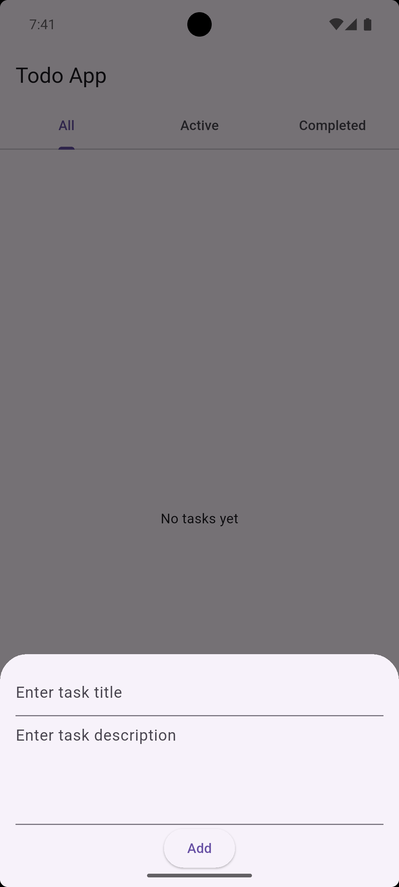
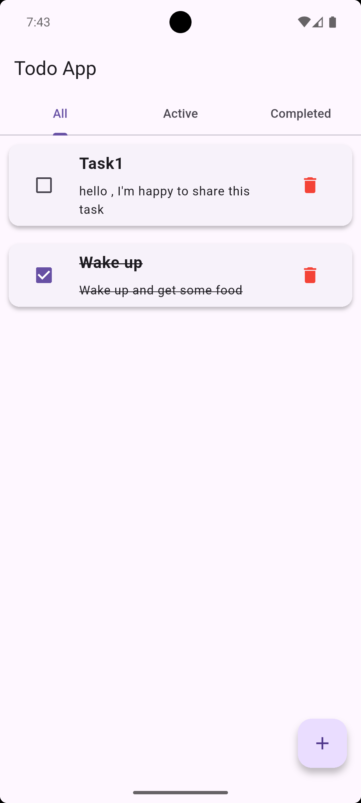
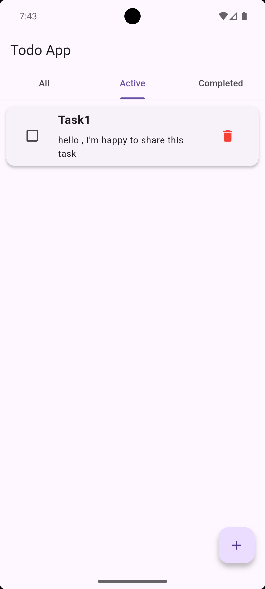
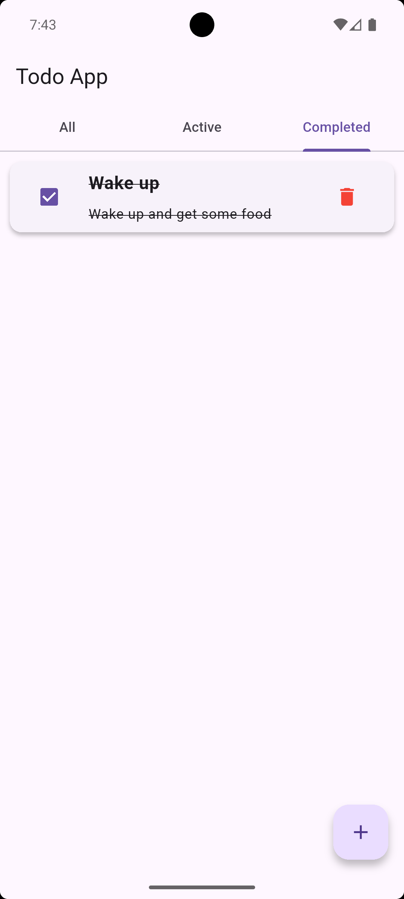

# 📝 Todo Tasks Project

This Flutter project demonstrates a simple **Todo App** with local persistence using Hive:
- Add new tasks (title + description) from a bottom sheet.
- Mark tasks as completed.
- Filter tasks by All / Active / Completed.
- Persistent storage with Hive.

## 📸 Screenshots

| Bottom Sheet | All Tasks |
|--------------|-----------|
|  |  |

| Active Tasks | Completed Tasks |
|--------------|----------------|
|  |  |
